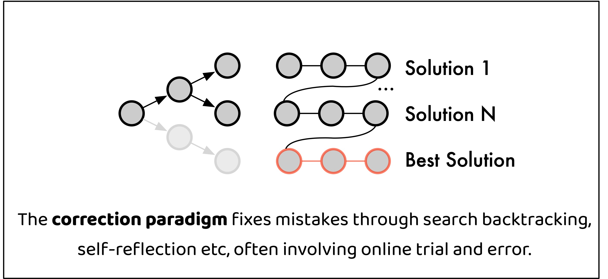
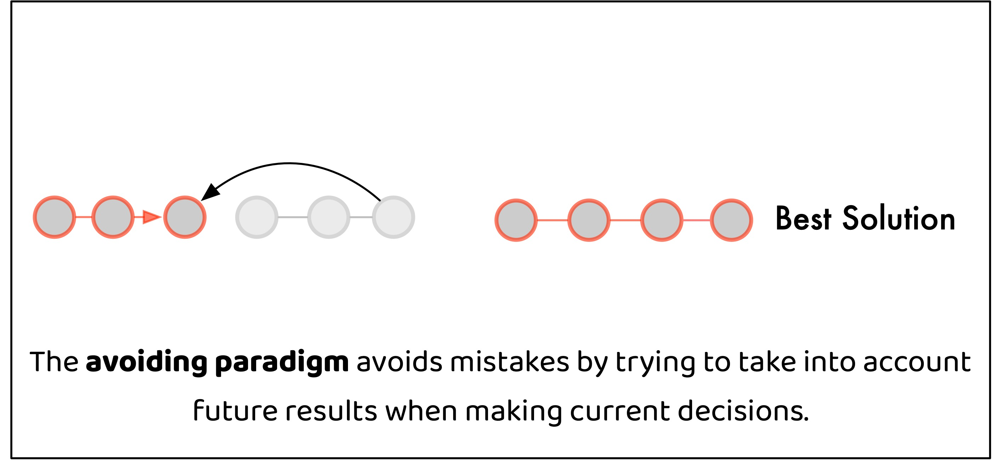
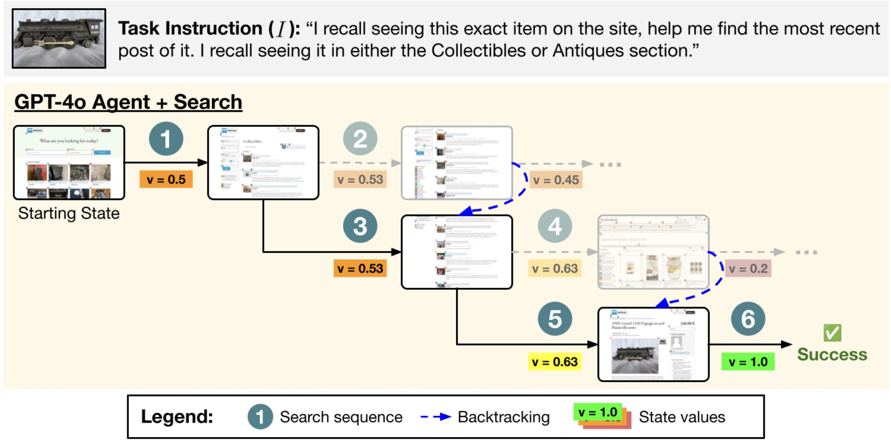

**TL;DR:** As strong reasoning and planning abilities emerge in Large Language Models (LLMs), LLMs become the de facto solver for complex problems. LLMs are unique in their step-by-step problem solving ability, the ability to perform ***sequential planning*** through autoregressive generation. However, errors tend to exist during planning as autoregressive generation are often imperfect, and it is fundamentally challenging to generate global-aware solutions at earlier steps. 

There are two solutions fixing this. The first is to fix the errors by correcting the mistakes, i.e. self-reflection. Most of the past work has been quite focused on demonstrating and improving the effectiveness of this paradigm. However, self-reflection abilities of many LLMs are limited and training generalizable reflection models are hard. We on the other hand, want to place emphasis on the second paradigm, avoiding the mistakes from happening. We show in our work **[Non-myopic Generation of Language Models for Reasoning and Planning]({{"https://arxiv.org/pdf/2410.17195"}})** how this could be implemented in a very simple decoding method that works for math, coding and agent tasks.

  
 
<em>Fig. 1. Illustrated comparison of two paradigms of avoiding planning mistakes with LLM generation.</em>

### Background

#### Correcting Mistakes Online
At inference times, LLMs could correct mistakes by incorporating previous context. After knowing what kinds of solutions would lead to errors, a LLM would change course of its solution and try to fix the mistakes and generate a correct solution. Search algorithms could deliberately guide this procedure [(Koh et al 2024)](https://arxiv.org/pdf/2407.01476). For example, 

 
 
<em>Fig. 2. Illustrated comparison of two paradigms of avoiding planning mistakes with LLM generation.</em>

